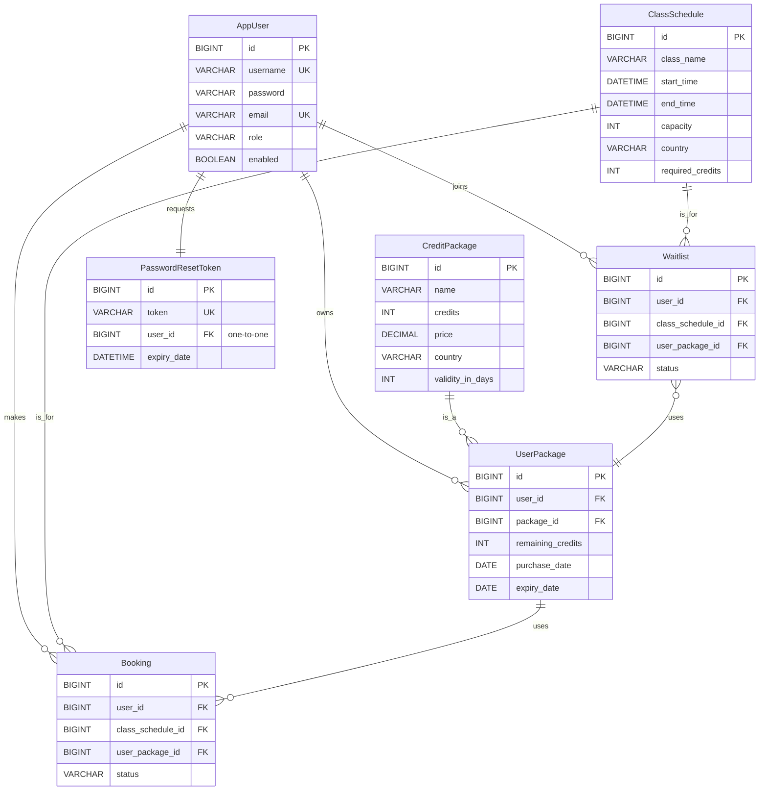

# Booking System API

This is a comprehensive RESTful API for a mobile application booking system, built with Spring Boot. It covers user management, package purchasing, class scheduling, booking, waitlists, and more, with a focus on clean architecture, security, and concurrency handling.

## Features

- **User Module**: User registration, login (with JWT), profile management, and password reset.
- **Package Module**: View and purchase country-specific credit packages.
- **Schedule & Booking Module**:
  - View class schedules by country.
  - Book classes using credits from a valid package.
  - Cancel bookings with a time-based credit refund policy.
  - Full waitlist management (join waitlist, FIFO promotion).
  - Class check-in functionality.
- **Concurrency Control**: Uses Redis for distributed locking to prevent overbooking.
- **Scheduled Tasks**: A Quartz scheduler refunds credits to waitlisted users after a class ends.
- **API Documentation**: Integrated Swagger/OpenAPI documentation.

---

## Prerequisites

To run this application, you will need:

1.  **Java 17** or later.
2.  **Maven 3.9** or later.
3.  **MySQL Server** running locally.
4.  **Redis Server** running locally on the default port (6379).

---

## How to Run

1.  **Clone the repository:**
    ```bash
    git clone <your-github-repo-url>
    cd booking-system-api
    ```

2.  **Create the Database:**
    - First, create the database manually in your MySQL server. You can use the following SQL command:
      ```sql
      CREATE DATABASE booking_system_db;
      ```

3.  **Configure the Connection:**
    - Open `src/main/resources/application.properties`.
    - Ensure the `spring.datasource.username` and `spring.datasource.password` match your local MySQL setup.

4.  **Run the application using Maven:**
    ```bash
    mvn spring-boot:run
    ```
    - The application will automatically create all the necessary tables (schema) and populate them with sample data from `data.sql`.

5.  **Access the API:**
    - The API will be available at `http://localhost:8080`.
    - **Swagger UI (API Documentation)**: Access `http://localhost:8080/swagger-ui.html` to view and test all endpoints.

---

## Database Schema

The database schema is automatically generated by Hibernate based on the JPA entities defined in the `com.codetest.bookingsystem.model` package.

Below is an Entity-Relationship Diagram (ERD) representing the database structure.



## Sample Data

Upon starting the application, initial sample data for **Credit Packages** and **Class Schedules** is automatically inserted into the database from the `src/main/resources/data.sql` file. This allows for immediate testing of the API endpoints.